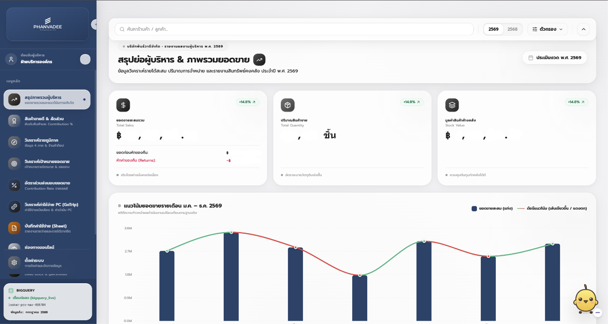
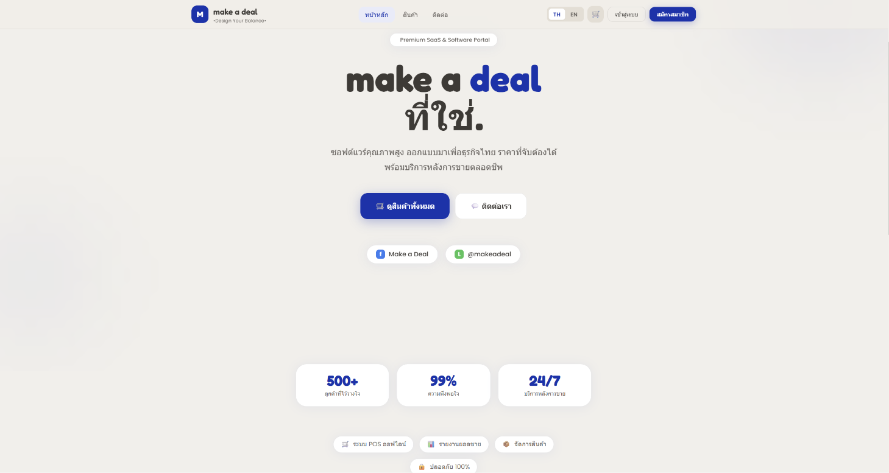
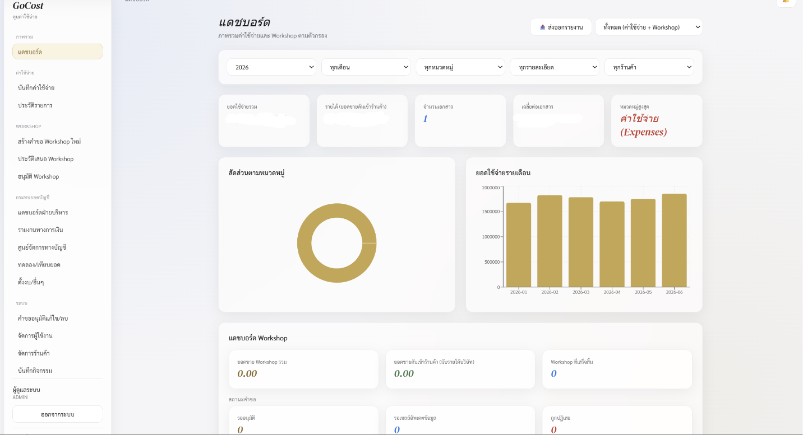
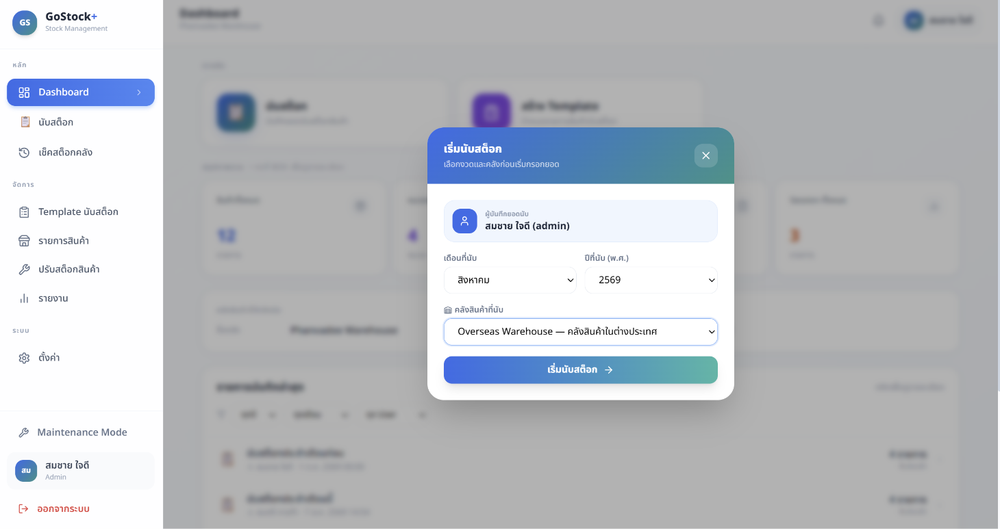
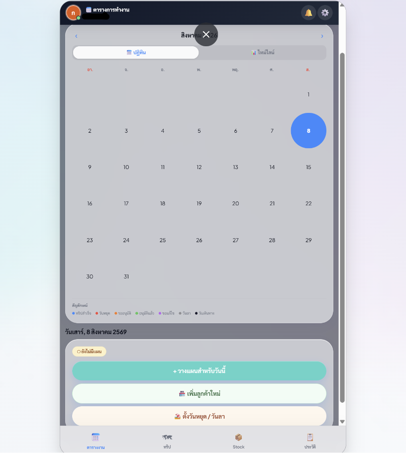
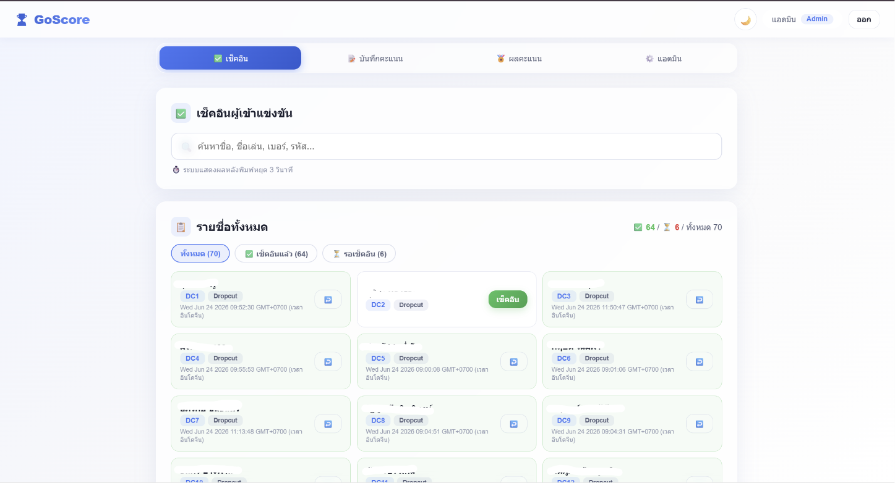

<!-- 👤 Header & Profile Section -->
<table border="0" width="100%">
  <tr>
    <td width="70%" valign="top">
      <h1>Hi there, I'm Pasin Amonprompukdee 👋</h1>
      
<b>Nickname:</b> Aum | <b>Age:</b> 27

      <h3>AI-Driven Full-Stack Developer & Data Solution Engineer</h3>
      
<i>"I specialize in building production-ready web applications, managing modern cloud databases, and developing data-driven executive dashboards using AI orchestration."</i>

    </td>
    <td width="30%" align="center" valign="middle">
  
</td>
  </tr>
</table>

---

## 💼 Work Experience

### **AI-Driven Full-Stack Developer & Data Solution Engineer**
**PHANVADEE CO.,LTD. (บริษัท พันธ์วาดี จำกัด)** | *Jul 2024 - Present*

Successfully transitioned from an operational role to leading the company's internal digital transformation, managing end-to-end IT, data infrastructure, and software development as a solo engineer.

**Key Responsibilities & Achievements:**

* 📊 **Data Analytics & Business Intelligence (BI)**
  * Engineered and maintained secure cloud data pipelines connecting **BigQuery, PostgreSQL, MongoDB, and Supabase**.
  * Executed monthly and yearly **Data Cleansing** to ensure absolute data integrity across all enterprise platforms.
  * Designed and delivered interactive, high-impact **Executive Dashboards via Looker Studio or Custom Web Apps** to support critical business decisions and board presentations.
  * Controlled and governed all corporate data assets to generate real-time metrics and dynamic meeting materials for top-level executives.

* 🤖 **AI & Software Development**
  * Spearheaded the company's **Paperless Initiative** by developing internal mobile and web systems using **AppSheet** to eliminate manual workflows.
  * Architected and deployed multiple custom production-ready web applications via **GitHub and Vercel** to cut down repetitive operations.
  * Formulated effective **Prompt Engineering** frameworks to leverage advanced AI tools for rapid software production and zero-code delivery.

* 🖥️ **IT Infrastructure & Technical Support**
  * Managed and troubleshot all corporate hardware devices, PCs, and peripheral equipment.
  * Configured essential drivers, operating networks, and specialized software installations (e.g., **Bluenote, Express**).
  * Evaluated and sourced high-efficiency IT hardware tailored to specific employee workflows.

---

## 🛠️ Tech Stack & Tools

- **Frontend & Deployment:** Next.js 14, React 18/19, Vite, Tailwind CSS, Vercel, GitHub
- **Low-Code / No-Code:** AppSheet, Google Apps Script (GAS)
- **Databases & Backend:** Supabase, PostgreSQL, BigQuery, MongoDB, NextAuth.js
- **Data Analytics & BI:** Looker Studio, Data Cleansing, Executive Dashboard Design
- **AI Automation:** Prompt Engineering, LLM Integration, Workflow Automation

---

## 🚀 Featured Projects

### 1. PHANVADEE Executive BI & Analytics Platform
- **Description:** Engineered an end-to-end data pipeline to cleanse, aggregate, and visualize monthly/yearly corporate data with independent store reporting and interactive pivot analysis.
- **Tech Stack:** React 19, BigQuery, Looker Studio, Tailwind CSS, Vite
- **Impact:** Consolidated multi-channel sales and operational data into real-time dynamic dashboards, saving 80% of preparation time for board meetings.
- **Live Demo:** NONE

### 2. Make a Deal — Premium SaaS & E-Commerce Portal
- **Description:** Built a high-performance SaaS e-commerce web portal for software licensing, featuring NextAuth.js authentication, PromptPay QR code checkout with automated slip verification, and zero-trust Edge Middleware protection.
- **Tech Stack:** Next.js 14 (App Router), TypeScript, NextAuth.js, Tailwind CSS, Google Apps Script (GAS)
- **Impact:** Created a seamless digital storefront with zero server-side cold start database overhead, automated software key distribution, and instant CMS customization.
- ****Live Demo:** NONE

### 3. GoCost — Enterprise Expense & Budget Control
- **Description:** Architected an internal budget control and expense logging system featuring Role-Based Access Control (RBAC), audit logging, approval workflows, and P&L account mapping.
- **Tech Stack:** React, Supabase, PostgreSQL, Tailwind CSS v4
- **Impact:** Streamlined corporate spending management, prevented budget overruns via annual budget caps, and ensured 100% data auditability.
- **Live Demo:** NONE

### 4. GoStock+ — Smart Inventory & Stock Control
- **Description:** Developed a premium inventory management web application supporting template-based audits, real-time variance analysis (stock discrepancies), and slow-moving inventory tracking.
- **Tech Stack:** React 18, Zustand, Supabase, SheetJS
- **Impact:** Transformed manual warehouse counting into a digital process, reducing stock auditing time and enabling instant Excel/PDF export capabilities.
- **Live Demo:** NONE

### 5. Plan Trip — Field Sales & PC Route Orchestration
- **Description:** Created a field sales management and route planning platform with calendar scheduling, GPS check-ins, OSRM driving distance calculations, and automated photo uploads.
- **Tech Stack:** React, Vercel Serverless, Google Drive API, OSRM Routing
- **Impact:** Optimized field sales routes, automated trip approval processes, and cut down manual reporting time for field personnel.
- **Live Demo:** NONE

### 6. GoScore — Real-time Competition Scoring System
- **Description:** Built a real-time competition registration and evaluation system featuring a touch-friendly scoring interface for judges and live aggregated scoreboard calculations.
- **Tech Stack:** Google Apps Script (GAS), Google Sheets API, HTML5, CSS3
- **Impact:** Replaced paper scoring cards completely, delivering real-time pivot table analysis and zero-delay winner calculations during live events.
- **Live Demo:** NONE

---

## 📈 GitHub Stats

  
  

 

  
  

---

## 💡 Career Journey

> *"ผมเริ่มงานที่นี่ในฐานะผู้ดูแลระบบคลังสินค้าออนไลน์ แต่พอเห็นปัญหาความซ้ำซ้อนของงานและเอกสารจำนวนมาก ผมเลยลุกขึ้นมาใช้สกิลสาย Code และพลังของ AI สร้างระบบขึ้นมาช่วยบริษัท เปลี่ยนระบบหลังบ้านเป็น Supabase/BigQuery/LookerStudio พัฒนาแอปผ่าน Vercel และทำแดชบอร์ดให้ผู้บริหาร จนสุดท้ายบริษัทไว้วางใจให้ผมดูแลระบบไอทีและเดต้าทั้งหมดขององค์กรแต่เพียงผู้เดียว"*

---

<!-- 🖼️ Portfolio Project Canvas Showcase -->
<h2 align="center">🛠️ Featured System Architecture & Project Showcase</h2>

  <b>ภาพรวมผลงานระบบ Enterprise Web Applications, Data Pipelines และ Internal Digitization</b>

<table border="0" width="100%">
  <!-- 📌 ROW 1: Executive Dashboard (Left) & Make a Deal (Right) -->
  <tr>
    <td width="50%" align="center" valign="top">
       
      
        
      <h3>📊 PHANVADEE Executive BI Platform</h3>
      
<b>ระบบรายงานผลงานผู้บริหารและท่อลำเลียงข้อมูลระดับองค์กร</b>

      
วิเคราะห์ข้อมูลธุรกรรมรายวัน ยอดขายสะสม ยอดขายเจาะจงรายร้านค้า (Independent Store Report) พร้อมระบบ Interactive Pivot Table เลือกช่วงเดือนสะสม

      

        
        
        
      

      

        <a href="https://your-dashboard-demo.vercel.app">🔗 Live Application</a>
      

    </td>
    <td width="50%" align="center" valign="top">
       
      
        
      <h3>🛍️ Make a Deal — Premium SaaS Portal</h3>
      
<b>ระบบเว็บพอร์ทัลร้านค้าออนไลน์ขายซอฟต์แวร์และระบบ POS หน้าร้าน</b>

      
ระบบชำระเงิน PromptPay QR สแกนตรวจเช็คสลับสลิปอัตโนมัติ, Edge Middleware ป้องกันสิทธิ์แบบ Zero-Trust และระบบ CMS ปรับแต่งหน้าเว็บสด

      

        
        
        
      

      

        <a href="https://your-makeadeal-demo.vercel.app">🔗 Live Demo</a>
      

    </td>
  </tr>

  <!-- 📌 ROW 2: GoCost (Left) & GoStock+ (Right) -->
  <tr>
    <td width="50%" align="center" valign="top">
       
      
        
      <h3>💸 GoCost — Enterprise Expense & Budget Control</h3>
      
<b>ระบบควบคุมงบประมาณและบันทึกค่าใช้จ่ายองค์กร</b>

      
จัดการสิทธิ์การเข้าถึง (Role-Based Permissions & Audit Logs), ระบบขออนุมัติแก้ไข/ลบเอกสาร, เชื่อมผังบัญชี P&L และตั้งงบประมาณ (Budget Cap) ประจำปี

      

        
        
        
      

      

        <a href="https://your-gocost-demo.vercel.app">🔗 Live Demo</a>
      

    </td>
    <td width="50%" align="center" valign="top">
       
      
        
      <h3>📦 GoStock+ — Smart Inventory & Stock Control</h3>
      
<b>ระบบบริหารและตรวจนับสต็อกสินค้าคงคลังพรีเมียม</b>

      
รองรับการตรวจนับผ่าน Template ตั้งต้น, คำนวณยอดขาด/เกิน/หาย (Variance Analysis), รายงานสินค้าเคลื่อนไหวช้า (Slow-Moving) พร้อม Export Excel/PDF ในตัว

      

        
        
        
      

      

        <a href="https://your-gostock-demo.vercel.app">🔗 Live Demo</a>
      

    </td>
  </tr>

  <!-- 📌 ROW 3: Plan Trip (Left) & GoScore (Right) -->
  <tr>
    <td width="50%" align="center" valign="top">
       
      
        
      <h3>🗺️ Plan Trip — Field Sales & Route Orchestration</h3>
      
<b>ระบบวางแผนทริปและติดตามการปฏิบัติงานหน้าร้าน</b>

      
ปฏิทินจัดตารางงานเซลล์/PC, เช็คอินระบุพิกัดพร้อมคำนวณระยะทางขับรถผ่าน OSRM, ระบบส่งอนุมัติทริป และอัปโหลดภาพถ่ายหน้าร้านขึ้น Google Drive API

      

        
        
        
      

      

        <a href="https://your-plantrip-demo.vercel.app">🔗 Live Demo</a>
      

    </td>
    <td width="50%" align="center" valign="top">
       
      
        
      <h3>🏆 GoScore — Real-time Competition Scoring System</h3>
      
<b>ระบบลงทะเบียนและประเมินผลคะแนนการแข่งขัน</b>

      
ระบบเช็คอินผู้เข้าแข่งขัน, ฟอร์มบันทึกคะแนน Touch-friendly Slider สำหรับกรรมการ, ตารางสรุปผลเปรียบเทียบเรียลไทม์ (Pivot Table Analysis)

      

        
        
        
      

      

        <a href="https://your-goscore-demo.com">🔗 View Architecture</a>
      

    </td>
  </tr>
</table>

 

  
💡 <i>Note: All systems demonstrated above were designed, built, and deployed as production-ready applications. Business logic, API keys, and sensitive database credentials have been omitted or sanitized for data privacy.</i>

