<!-- Header -->

 

<table border="0" width="100%">
  <tr>
    <td width="68%" valign="middle">
      
        
      

        
        
        
      

      
<i>"I specialize in building production-ready web applications, managing modern cloud databases, and developing data-driven executive dashboards using AI orchestration."</i>

    </td>
    <td width="32%" align="center" valign="middle">
      
    </td>
  </tr>
</table>

  <a href="#experience">Experience</a> ·
  <a href="#stack">Tech Stack</a> ·
  <a href="#badges">Badges</a> ·
  <a href="#certificates">Certificates</a> ·
  <a href="#projects">Projects</a> ·
  <a href="#stats">GitHub Stats</a> ·
  <a href="#journey">Career Journey</a>

 

## 💼 Experience

<table border="0" width="100%">
<tr><td>

**AI-Driven Full-Stack Developer & Data Solution Engineer**
`PHANVADEE CO., LTD. (บริษัท พันธ์วาดี จำกัด)` — *Jul 2024 – Present*

 

Transitioned from an operational role into leading the company's full digital transformation — owning IT infrastructure, data architecture, and software delivery as a single-person engineering function.

</td></tr>
</table>

<b>📊 Data Analytics & Business Intelligence</b>

 

- Engineered and maintained secure cloud data pipelines across **BigQuery, PostgreSQL, MongoDB, and Supabase**
- Ran monthly and yearly **data cleansing** cycles to keep enterprise data fully trustworthy
- Designed and shipped interactive **executive dashboards** (Looker Studio + custom web apps) for board-level decisions
- Governed all corporate data assets to produce real-time metrics and live meeting materials for leadership

<b>🤖 AI & Software Development</b>

 

- Led the company's **Paperless Initiative**, building internal mobile/web systems with **AppSheet** to remove manual workflows
- Architected and shipped multiple production web apps via **GitHub → Vercel**, replacing repetitive manual operations
- Built repeatable **prompt engineering** frameworks to ship software faster with AI-assisted, low-code delivery

<b>🖥️ IT Infrastructure & Technical Support</b>

 

- Managed and troubleshot all corporate hardware, PCs, and peripherals
- Configured drivers, networking, and specialized software (e.g. Bluenote, Express)
- Sourced and evaluated IT hardware matched to each team's workflow

 

## 🛠️ Tech Stack

  <b>Frontend & Deployment</b> 
  
  
  
  
  
  

  <b>Databases & Backend</b> 
  
  
  
  
  

  <b>Data Analytics & BI</b> 
  
  
  

  <b>Low-Code & AI Automation</b> 
  
  
  
  

 

## 🏅 Certifications & Badges

  

<i>📌 คลิกที่ Badge ด้านล่างเพื่อขยายดูแบบเต็ม (คลิกซ้ำเพื่อย่อกลับ) — GitHub README ไม่รองรับการขยายภาพด้วยการเอาเมาส์ไปชี้ (hover) เพราะระบบความปลอดภัยของ GitHub ตัด CSS/JavaScript แบบ interactive ออกจากไฟล์ README เสมอ จึงใช้ "คลิกเพื่อขยาย" แทน ซึ่งเป็นวิธีที่ใกล้เคียงที่สุดที่ทำงานได้จริงบน GitHub</i>

<table align="center" border="0">
<tr>
<td align="center" width="11%">

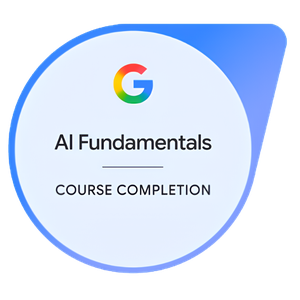 <b>AI Fundamentals</b>

</td>
<td align="center" width="11%">

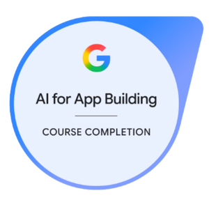 <b>App Building</b>

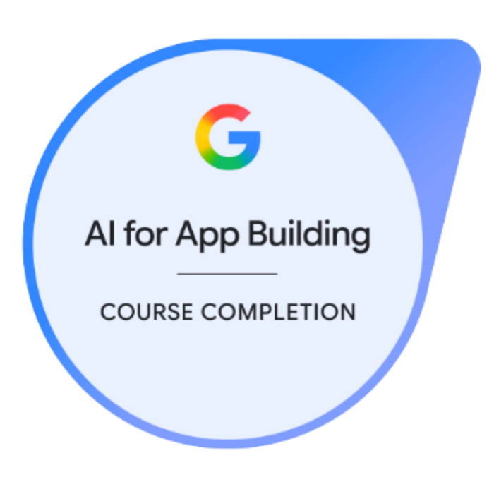

</td>
<td align="center" width="11%">

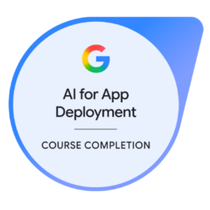 <b>App Deployment</b>

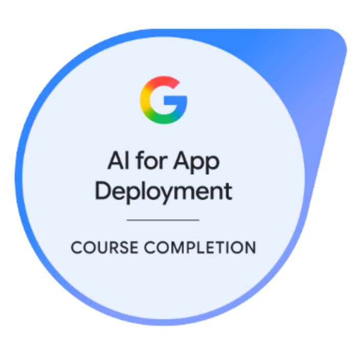

</td>
<td align="center" width="11%">

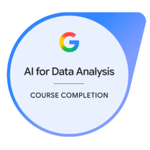 <b>Data Analysis</b>

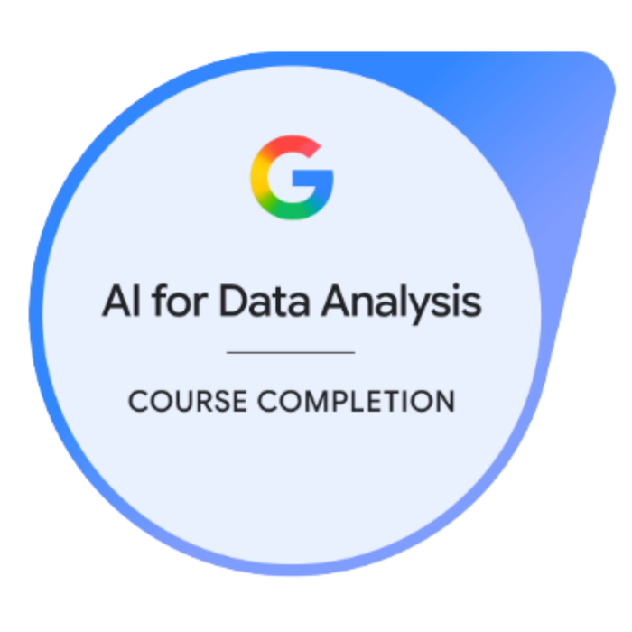

</td>
<td align="center" width="11%">

 <b>Research</b>

</td>
<td align="center" width="11%">

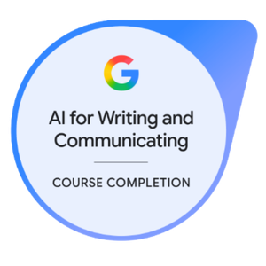 <b>Writing & Comm.</b>

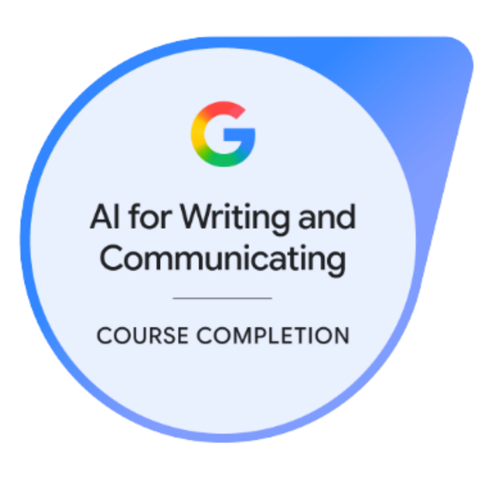

</td>
<td align="center" width="11%">

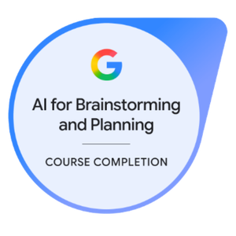 <b>Brainstorming</b>

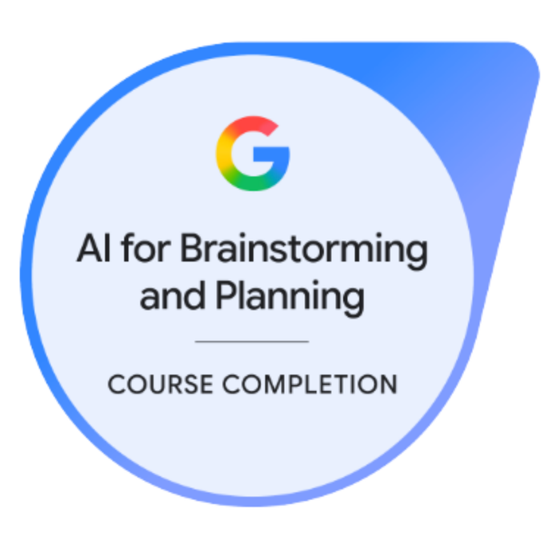

</td>
<td align="center" width="11%">

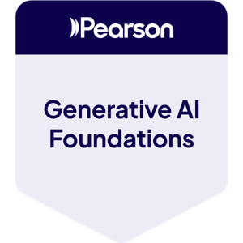 <b>GenAI Foundations</b>

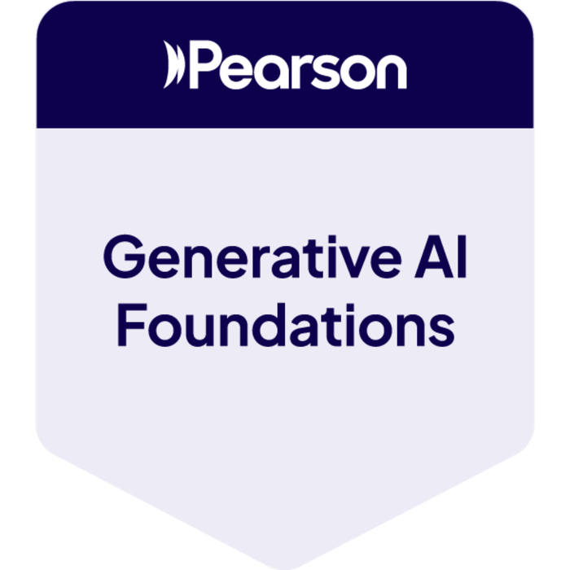

</td>
<td align="center" width="11%">

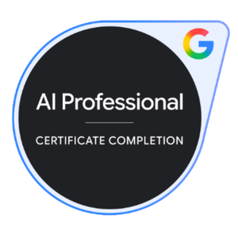 <b>AI Professional</b>

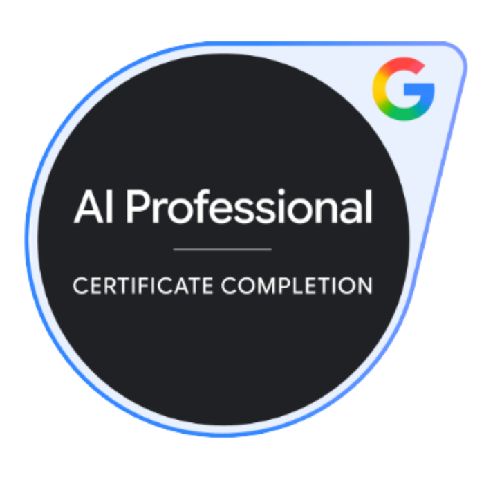

</td>
</tr>
</table>

 

## 📜 Certificate Wall

  

<i>📌 คลิกที่ใบประกาศนียบัตรด้านล่างเพื่อขยายอ่านฉบับเต็ม (คลิกซ้ำเพื่อย่อกลับ)</i>

<table align="center" border="0">
<tr>
<td align="center" width="50%">

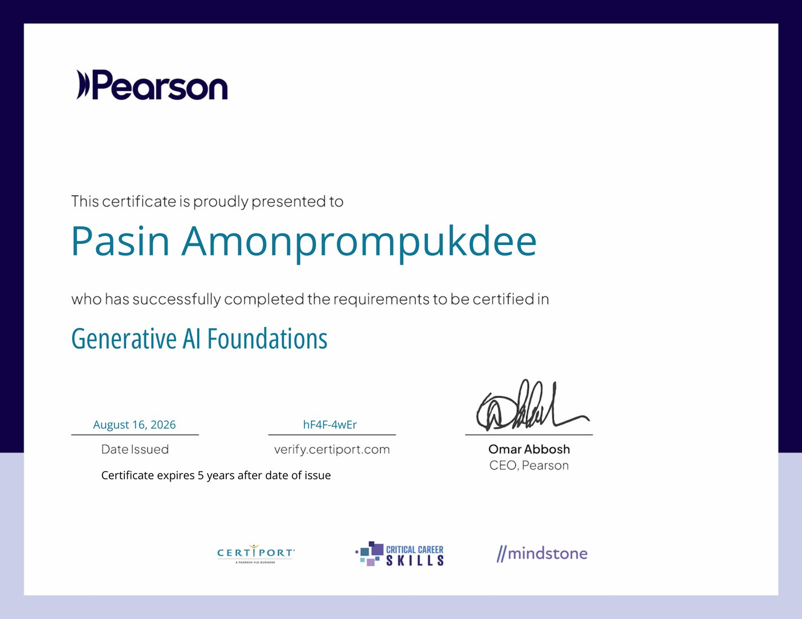 <b>Generative AI Foundations</b> Pearson · Certiport · Aug 2026

</td>
<td align="center" width="50%">

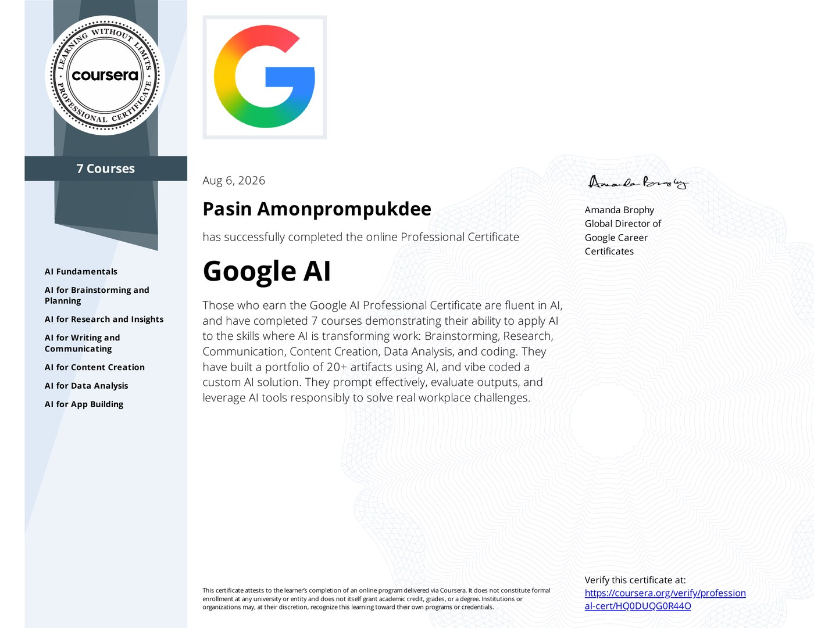 <b>Google AI — Professional Certificate</b> Coursera · Google Career Certificates · Aug 2026

</td>
</tr>
</table>

 

## 🚀 Featured Projects

เลือกโปรเจกต์เพื่อเลื่อนไปดูรายละเอียดและภาพระบบด้านล่าง

| # | Project | What it does | Core Stack |
|---|---------|---------------|-------------|
| 01 | [PHANVADEE Executive BI Platform](#proj-bi) | Cleanses & visualizes company-wide sales data into live executive dashboards | React 19 · BigQuery · Looker Studio |
| 02 | [Make a Deal](#proj-deal) | SaaS storefront with PromptPay QR checkout & automated slip verification | Next.js 14 · NextAuth.js · GAS |
| 03 | [GoCost](#proj-cost) | RBAC expense & budget-control system with full audit trail | React · Supabase · PostgreSQL |
| 04 | [GoStock+](#proj-stock) | Inventory audits with real-time variance analysis | React 18 · Zustand · Supabase |
| 05 | [Plan Trip](#proj-trip) | Field-sales route planning with GPS check-in & OSRM routing | React · Vercel Serverless · Google Drive API |
| 06 | [GoScore](#proj-score) | Real-time competition scoring & live leaderboard | Google Apps Script · Sheets API |

 

### 📊 01 · PHANVADEE Executive BI & Analytics Platform
 

**ระบบรายงานผลงานผู้บริหารและท่อลำเลียงข้อมูลระดับองค์กร** — วิเคราะห์ข้อมูลธุรกรรมรายวัน ยอดขายสะสม และยอดขายเจาะจงรายร้านค้า (Independent Store Report) พร้อม Interactive Pivot Table เลือกช่วงเดือนสะสม

**Impact:** รวมข้อมูลยอดขายและปฏิบัติการจากหลายช่องทางเข้าเป็นแดชบอร์ดเดียว ลดเวลาการเตรียมข้อมูลก่อนประชุมบอร์ดลง 80%

React 19 · BigQuery · Looker Studio · Tailwind CSS · Vite

---

### 🛍️ 02 · Make a Deal — Premium SaaS & E-Commerce Portal
 

**ระบบเว็บพอร์ทัลร้านค้าออนไลน์ขายซอฟต์แวร์และระบบ POS หน้าร้าน** — ชำระเงินผ่าน PromptPay QR พร้อมตรวจสอบสลิปอัตโนมัติ, ป้องกันสิทธิ์แบบ Zero-Trust ด้วย Edge Middleware และปรับแต่งหน้าเว็บสดผ่าน CMS

**Impact:** สร้างหน้าร้านดิจิทัลที่ไม่มี cold start จากฝั่งฐานข้อมูล พร้อมแจกจ่าย license key และปรับแต่ง CMS แบบเรียลไทม์

Next.js 14 (App Router) · TypeScript · NextAuth.js · Tailwind CSS · Google Apps Script

---

### 💸 03 · GoCost — Enterprise Expense & Budget Control
 

**ระบบควบคุมงบประมาณและบันทึกค่าใช้จ่ายองค์กร** — จัดการสิทธิ์การเข้าถึง (RBAC) พร้อม Audit Log, ระบบขออนุมัติแก้ไข/ลบเอกสาร, เชื่อมผังบัญชี P&L และตั้ง Budget Cap ประจำปี

**Impact:** จัดระเบียบการใช้จ่ายองค์กร ป้องกันงบประมาณบานปลาย และตรวจสอบย้อนหลังได้ 100%

React · Supabase · PostgreSQL · Tailwind CSS v4

---

### 📦 04 · GoStock+ — Smart Inventory & Stock Control
 

**ระบบบริหารและตรวจนับสต็อกสินค้าคงคลังพรีเมียม** — ตรวจนับผ่าน Template ตั้งต้น, คำนวณยอดขาด/เกิน/หาย (Variance Analysis), รายงานสินค้าเคลื่อนไหวช้า พร้อม Export Excel/PDF ในตัว

**Impact:** เปลี่ยนการนับสต็อกด้วยมือให้เป็นดิจิทัล ลดเวลาตรวจนับ พร้อม export รายงานได้ทันที

React 18 · Zustand · Supabase · SheetJS

---

### 🗺️ 05 · Plan Trip — Field Sales & Route Orchestration
 

**ระบบวางแผนทริปและติดตามการปฏิบัติงานหน้าร้าน** — ปฏิทินจัดตารางงานเซลล์/PC, เช็คอินระบุพิกัดพร้อมคำนวณระยะทางขับรถผ่าน OSRM, ระบบส่งอนุมัติทริป และอัปโหลดภาพถ่ายหน้าร้านขึ้น Google Drive API

**Impact:** ปรับเส้นทางเซลล์ให้เหมาะสม, อัตโนมัติกระบวนการอนุมัติทริป และลดเวลารายงานของทีมภาคสนาม

React · Vercel Serverless · Google Drive API · OSRM Routing

---

### 🏆 06 · GoScore — Real-time Competition Scoring System
 

**ระบบลงทะเบียนและประเมินผลคะแนนการแข่งขัน** — เช็คอินผู้เข้าแข่งขัน, ฟอร์มบันทึกคะแนนแบบ Touch-friendly Slider สำหรับกรรมการ, ตารางสรุปผลเปรียบเทียบเรียลไทม์

**Impact:** แทนที่บัตรให้คะแนนกระดาษทั้งหมด พร้อมวิเคราะห์ผลแบบ Pivot Table และประกาศผู้ชนะแบบไม่มีดีเลย์

Google Apps Script · Google Sheets API · HTML5 · CSS3

 

## 📈 GitHub Stats

  
  

  
  

 

## 💡 Career Journey

> *"ผมเริ่มงานที่นี่ในฐานะผู้ดูแลระบบคลังสินค้าออนไลน์ แต่พอเห็นปัญหาความซ้ำซ้อนของงานและเอกสารจำนวนมาก ผมเลยลุกขึ้นมาใช้สกิลสาย Code และพลังของ AI สร้างระบบขึ้นมาช่วยบริษัท เปลี่ยนระบบหลังบ้านเป็น Supabase/BigQuery/LookerStudio พัฒนาแอปผ่าน Vercel และทำแดชบอร์ดให้ผู้บริหาร จนสุดท้ายบริษัทไว้วางใจให้ผมดูแลระบบไอทีและเดต้าทั้งหมดขององค์กรแต่เพียงผู้เดียว"*

 

  All systems above were designed, built, and deployed as production-ready enterprise applications. Business logic, API keys, and database credentials have been sanitized for data privacy.

